<h1 align="center">공지메이트</h1>
<p align="center">
  <strong>메일과 첨부파일을 분석해 홈페이지 · SNS · 문자 공지 초안을 한 번에 만드는 AI 공지 작성 서비스</strong>
</p>

<p align="center">
  <a href="https://knu-team3-9d7b4.web.app">서비스 바로가기</a>
  ·
  <a href="https://github.com/koel5696/notice-mate-ai-server">AI 서버 저장소</a>
</p>

## 1. Overview

- 공지메이트는 기관 메일, 첨부파일, 홍보 이미지에 흩어진 정보를 분석해 공지 작성에 필요한 핵심 항목을 정리하는 서비스입니다.
- 대상, 기간, 혜택, 신청 방법, 문의처를 추출하고 홈페이지 공지, SNS 게시글, 문자 안내문 형태의 초안을 제공합니다.
- 로그인 사용자는 작성한 공지를 저장하고 다시 불러와 수정 안내 메일을 반영할 수 있습니다.
- 브라우저 처리와 AI 서버 분석을 함께 사용하며, 첨부파일은 지원 형식과 구조를 검증한 뒤 분석 흐름에 포함합니다.

## 2. Service Introduction


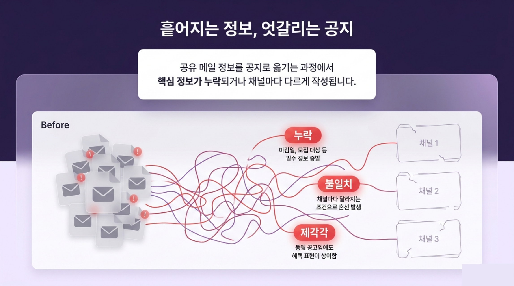
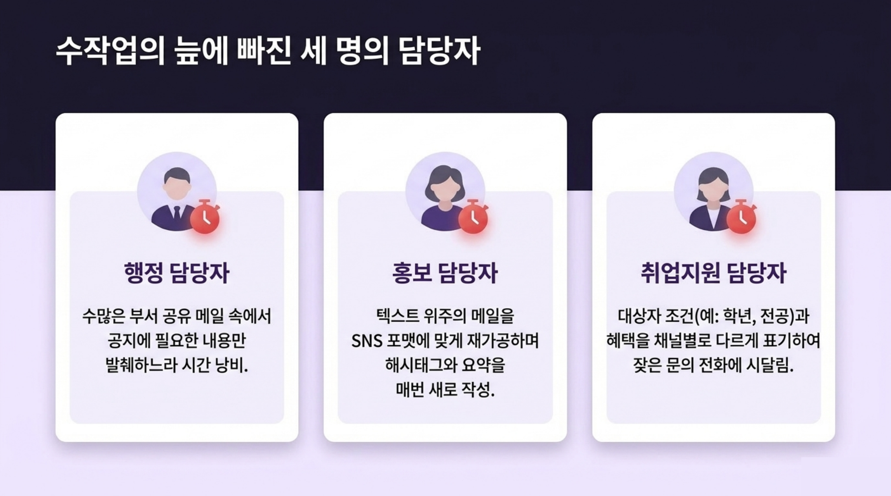
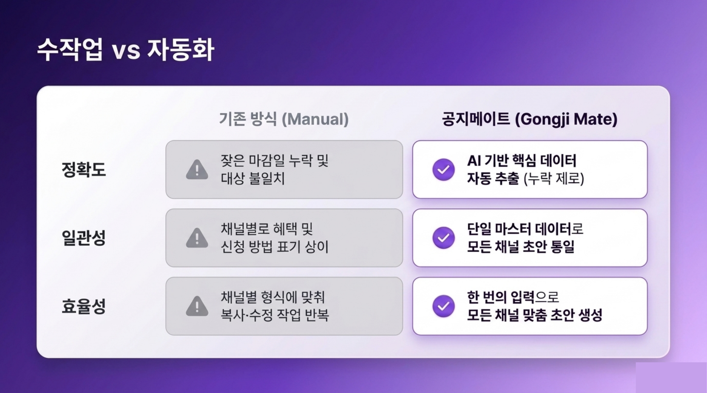
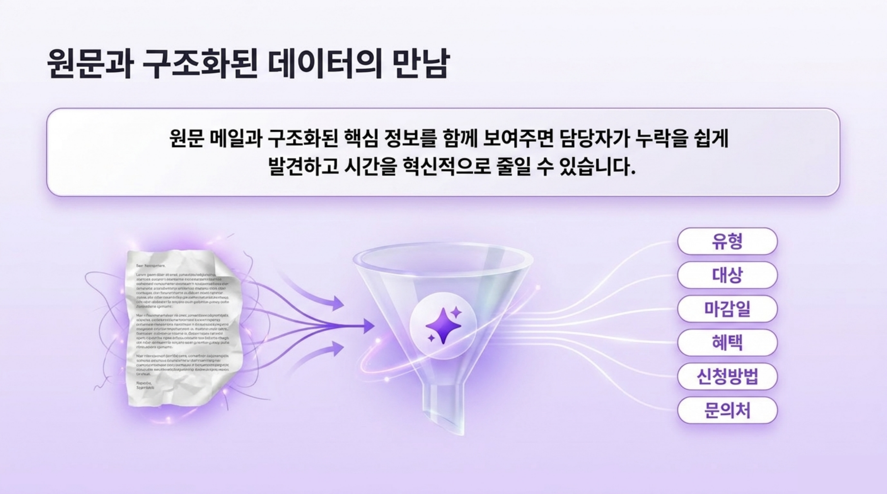
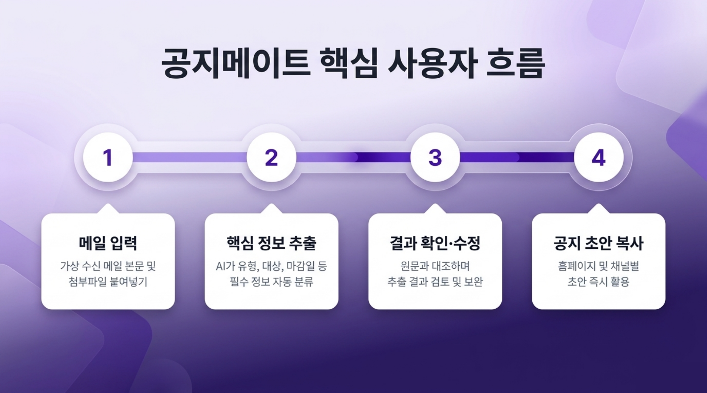
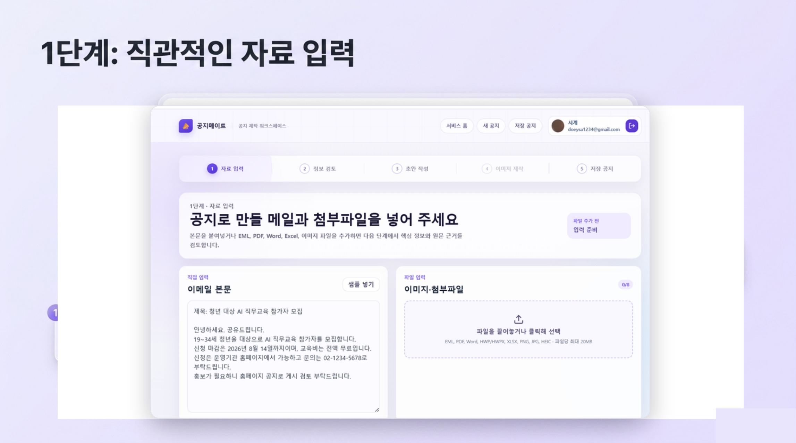
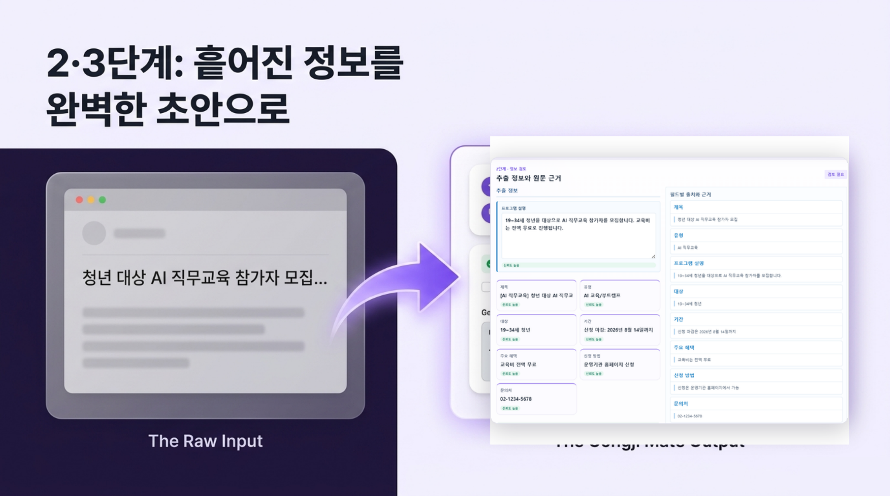
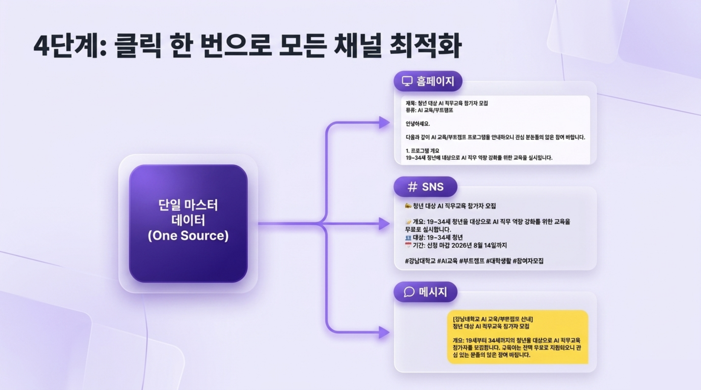
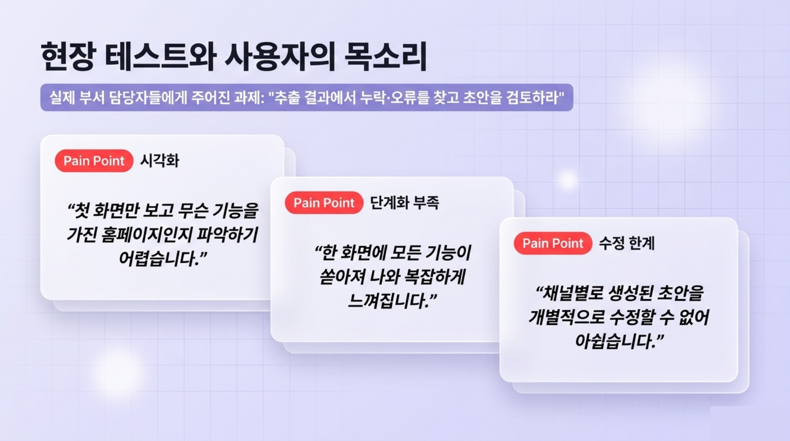
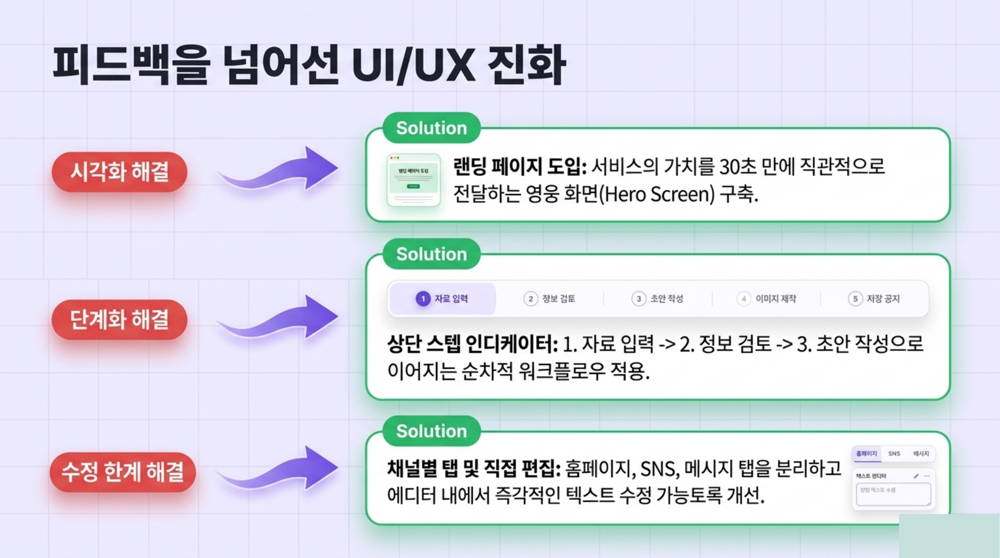
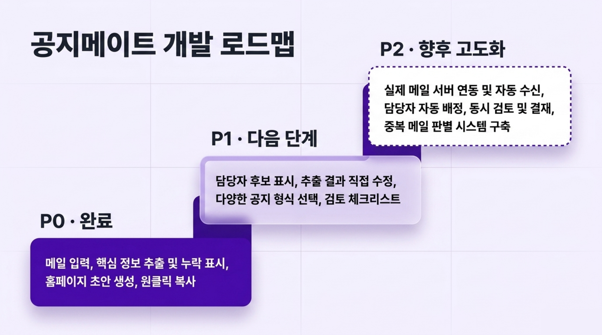
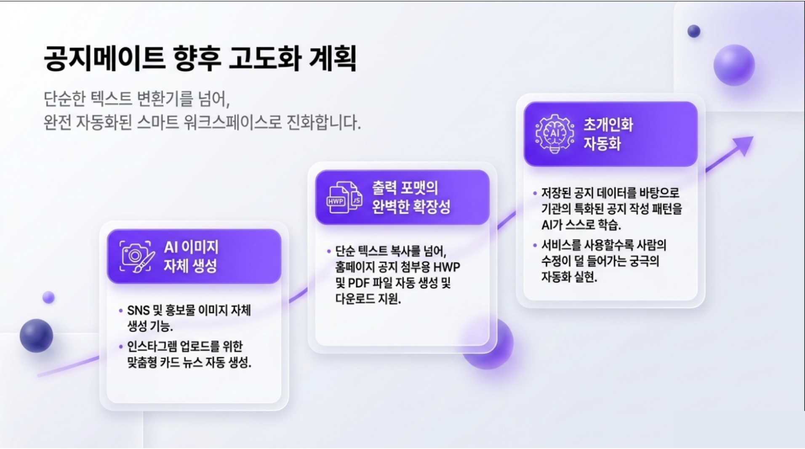

## 3. 주요 기능 소개

### 1). 메일 및 첨부파일 분석

- 메일 원문과 PDF, Word, Excel, 이미지 첨부파일을 함께 분석합니다.
- 이미지 속 QR 코드와 텍스트를 읽어 신청 링크, 일정, 문의처 후보를 추출합니다.
- 본문과 첨부파일에서 서로 같은 의미의 값은 중복 후보로 남기지 않고 대표 값으로 정리합니다.

### 2). 필드별 핵심 정보 정리

- 공지 유형, 제목, 프로그램 설명, 대상, 기간, 주요 혜택, 신청 방법, 문의처를 필드별로 정리합니다.
- 여러 일정이 있는 프로그램은 프로그램별 기간과 시간을 구분해 보여줍니다.
- 필드별 근거는 실제 메일 본문이나 첨부파일에서 확인된 문장을 중심으로 제공합니다.

### 3). 채널별 공지 초안 생성

- 홈페이지 공지, SNS 게시글, 문자 안내문 초안을 각각 생성합니다.
- 문자 안내문은 발신 소속을 입력해 실제 발송 문맥에 맞게 사용할 수 있습니다.
- 복사 전 검토 체크를 통해 게시 전 확인 흐름을 유지합니다.

### 4). 로그인 기반 저장 및 수정

- Firebase Authentication 구글 로그인을 제공합니다.
- 로그인 사용자는 작성한 공지를 Firestore에 저장하고 다시 불러올 수 있습니다.
- 기존 공지를 불러온 뒤 수정 안내 메일을 입력하면 변경된 항목만 반영해 업데이트할 수 있습니다.

### 5). 첨부파일 처리 정책

- PDF, DOCX, HWPX, XLSX, 이미지 파일을 중심으로 지원합니다.
- 업로드 파일은 확장자와 실제 파일 구조를 함께 확인합니다.
- 구형 바이너리 문서 파일처럼 안전한 구조 검증이 어려운 형식은 직접 분석 대상에서 제외합니다.

## 4. Features

| 기능 | 설명 |
|------|------|
| 메일 분석 | 메일 본문에서 공지 작성에 필요한 핵심 정보를 추출 |
| 첨부파일 분석 | PDF, Word, Excel, 이미지 파일의 텍스트와 링크를 분석 |
| AI 분석 연동 | 별도 Spring Boot AI 서버를 통해 Gemini 기반 분석 결과 반영 |
| 채널별 초안 | 홈페이지, SNS, 문자 형식에 맞춘 공지 초안 생성 |
| 저장 및 불러오기 | 로그인 사용자의 공지 초안을 Firestore에 저장하고 재사용 |
| 수정 메일 반영 | 기존 공지에 변경 안내 메일의 수정 항목만 반영 |
| 파일 검증 | 지원 파일 형식과 내부 구조를 확인한 뒤 분석 진행 |

## 5. Tech Stack

### Frontend


### Document Processing


### Backend & AI


### Deployment


## 6. System Architecture

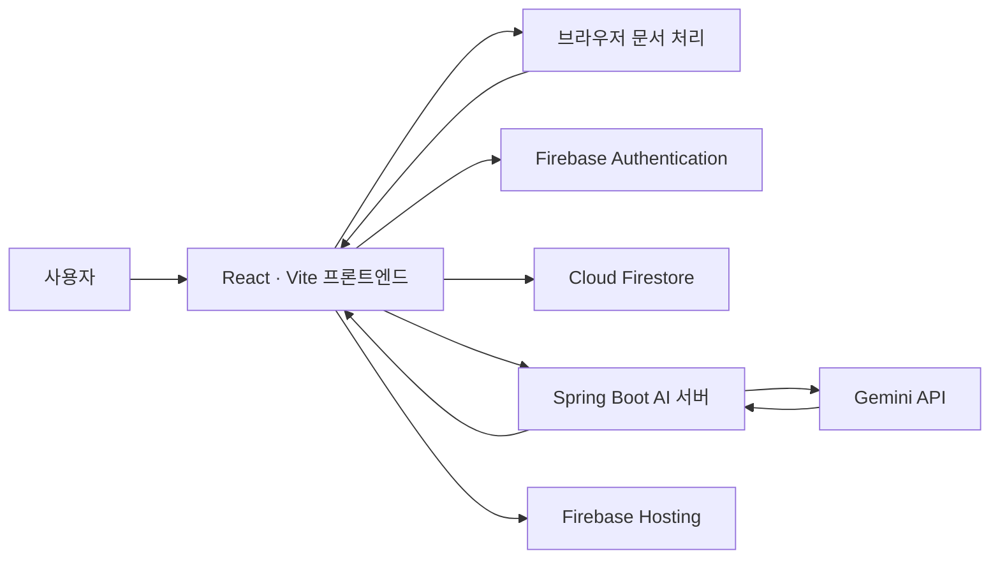

## 7. Getting Started

```bash
npm install
npm run dev
```

품질 확인:

```bash
npm run lint
npm run check:prototype
npm run build
```

환경 변수는 `.env.example`을 참고해 `.env`에 설정합니다.

```env
VITE_APP_ENV=development
VITE_FIREBASE_API_KEY=
VITE_FIREBASE_AUTH_DOMAIN=
VITE_FIREBASE_PROJECT_ID=
VITE_FIREBASE_STORAGE_BUCKET=
VITE_FIREBASE_MESSAGING_SENDER_ID=
VITE_FIREBASE_APP_ID=
VITE_FIREBASE_MEASUREMENT_ID=
VITE_NOTICE_AI_API_URL=
```

## 8. Deployment

- `main` 브랜치에 반영되면 GitHub Actions를 통해 Firebase Hosting 배포가 진행됩니다.
- Firestore 규칙과 인덱스도 배포 워크플로에서 함께 관리합니다.
- AI 분석 서버는 별도 저장소에서 Spring Boot 애플리케이션으로 관리하며 AWS EC2에 배포합니다.

## 9. Team

- 강남대학교 AI 부스트캠프 팀 프로젝트
- 공지 작성 업무를 줄이고, 검토 가능한 공지 초안 생성 흐름을 만드는 것을 목표로 진행했습니다.
